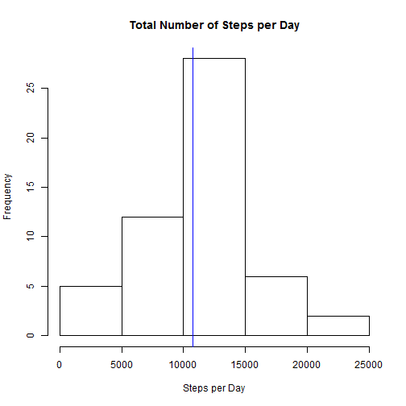
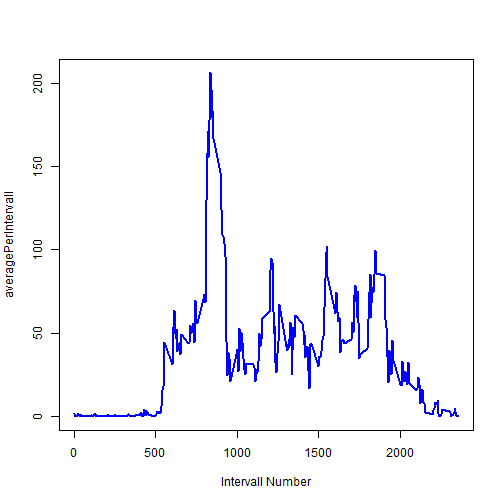
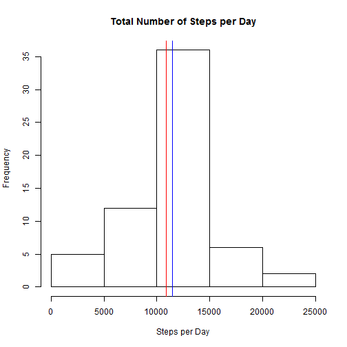
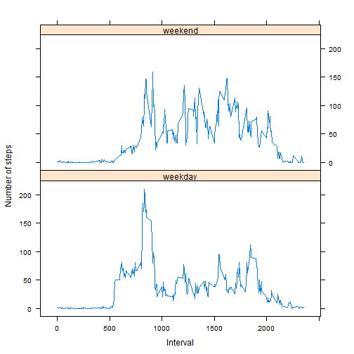

# Reproducible Research: Peer Assessment 1


## Loading and preprocessing the data
(1/2) We load the data and set the time zone, but make no transformations:

```r
## Firstly, set the working directory, if necessary:
## setwd('C:/Users/**********your
## directory***********/RepData/RepData_PeerAssessment1')

## We load the activity-data: 3 columns: steps date interval
ACT <- read.csv("activity.csv", header = T, colClasses = c("integer", "Date", 
    "integer"))
Sys.setlocale(category = "LC_TIME", locale = "US")
```

```
## [1] "English_United States.1252"
```


## What is mean total number of steps taken per day?
(1) Firstly, we do the histogram:

```r
stepsPerDay <- unlist(tapply(ACT[, 1], ACT[, 2], sum))
hist(stepsPerDay, xlab = "Steps per Day", main = "Total Number of Steps per Day")
abline(v = mean(stepsPerDay, na.rm = T), col = "red")
abline(v = median(stepsPerDay, na.rm = T), col = "blue")
```

 

(2) So the mean (red line) is

```r
mean(stepsPerDay, na.rm = T)
```

```
## [1] 10766
```

and the median (blue line) is

```r
median(stepsPerDay, na.rm = T)
```

```
## [1] 10765
```


## What is the average daily activity pattern?
(1) We do a time series plot:

```r
averagePerIntervall <- unlist(tapply(ACT[, 1], ACT[, 3], mean, na.rm = T))
plot(names(averagePerIntervall), averagePerIntervall, type = "l", xlab = "Intervall Number", 
    lwd = 2, col = "blue")
```

 


(2) The maximum number of steps across all days is in the following 5-minute intervall (begin of interval coded as "hour minute" hhmm):

```r
maxi <- max(averagePerIntervall)
logo <- averagePerIntervall == maxi
names(averagePerIntervall[logo])
```

```
## [1] "835"
```


The maximum number of steps is (perhaps it may be interesting)

```r
maxi
```

```
## [1] 206.2
```


## Imputing missing values

(1) The number of rows with missing values is:

```r
nrow(ACT) - sum(complete.cases(ACT))
```

```
## [1] 2304
```

(2) One possible strategy to get rid of the NA's is to substitute them with an adequate mean-value. Such a value is the mean of steps per interval.

(3) Now we substitute the missing values with this mean of steps of the intervals. Additionally we create a new dataset ACTmerged:

```r
abc <- data.frame(interval = as.integer(names(averagePerIntervall)), steps1 = averagePerIntervall)
ACTmerged <- merge(ACT, abc, by.x = "interval", by.y = "interval", all = T)
ACTmerged$steps <- as.numeric(ACTmerged$steps)
ACTmerged$steps[is.na(ACTmerged$steps)] <- ACTmerged$steps1[is.na(ACT[, 1])]
```


(4) Now we have the following histogram:

```r
stepsPerDay1 <- unlist(tapply(ACTmerged$steps, ACTmerged$date, sum))
hist(stepsPerDay1, xlab = "Steps per Day", main = "Total Number of Steps per Day")
abline(v = mean(stepsPerDay1), col = "red")
abline(v = median(stepsPerDay1), col = "blue")
```

 


So the mean (red line) is now

```r
mean(stepsPerDay1)
```

```
## [1] 10890
```

and the median (blue line) is

```r
median(stepsPerDay1)
```

```
## [1] 11458
```

The values are greater than before, but they are also more reasonable, because the NA's are now represented with a mean.

## Are there differences in activity patterns between weekdays and weekends?

(1) We create a factor variable with 2 levels, weekday and weekend:

```r
dayCategoryBool <- weekdays(ACTmerged$date) == "Saturday" | weekdays(ACTmerged$date) == 
    "Sunday"
dayCategory <- seq_along(dayCategoryBool)
dayCategory[dayCategoryBool] <- "weekend"
dayCategory[!dayCategoryBool] <- "weekday"
ACTmerged$dayCat <- as.factor(dayCategory)
```

(2) Now we do the panel plot:

```r
weekdays1 <- ACTmerged$dayCat == "weekday"
weekend1 <- ACTmerged$dayCat == "weekend"
ACTweekdays <- ACTmerged[weekdays1, ]
ACTweekend <- ACTmerged[weekend1, ]

dataweekdays <- unlist(tapply(ACTweekdays$steps, ACTweekdays$interval, mean))
dataweekend <- unlist(tapply(ACTweekend$steps, ACTweekend$interval, mean))

df1 <- data.frame(interval = names(dataweekdays), steps = dataweekdays, mode = "weekday")
df2 <- data.frame(interval = names(dataweekend), steps = dataweekend, mode = "weekend")
df <- rbind(df1, df2)
df$interval <- as.numeric(as.character(df$interval))

library(lattice)
xyplot(steps ~ interval | mode, df, type = "l", xlab = "Interval", ylab = "Number of steps", 
    layout = c(1, 2))
```

 


As can be seen, there are some differences between weekdays and weekend-days.


